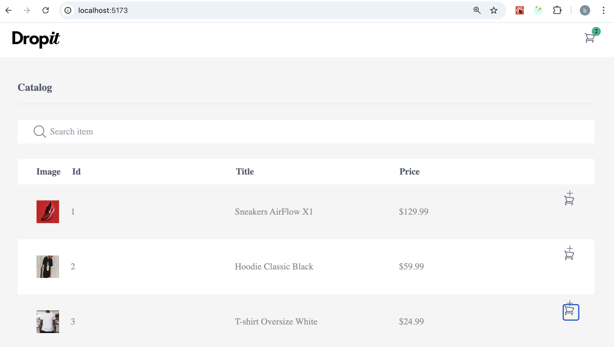
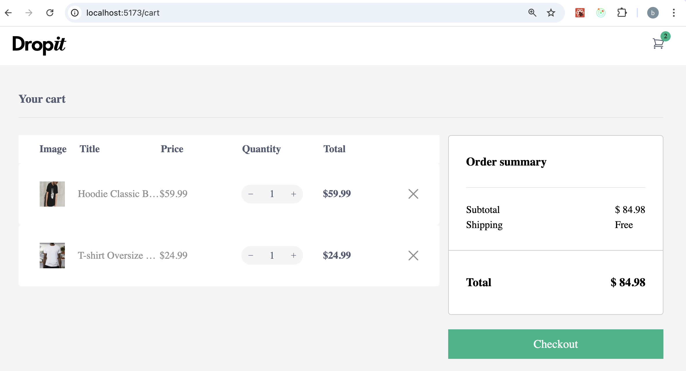

# How to run it 
📦 React + TypeScript + Vite + Node.js

A simple e-commerce demo with a product list, cart system, and checkout flow.

🖥️ Preview
▶️ Main Page

🛒 Cart Page

🚀 How to Run the Project
1️⃣ Start the Backend
cd backend
npm install
npm run build
npm run start:prod

2️⃣ Start the Frontend
cd ..
npm install
npm run dev

Then open your browser at:
👉 http://localhost:5173/

🧪 How It Works

Click the cart icon on any product to add it to your cart.

The green badge in the top-right corner increments with each item added.

Click the cart icon in the header to open the Cart page.

On the Cart page, click the green “Checkout” button to view your order summary.

✔️ Features

React + TypeScript + Vite

Node.js + Express backend

Product listing (mock data)

Cart management with quantities

Simple checkout alert summary
